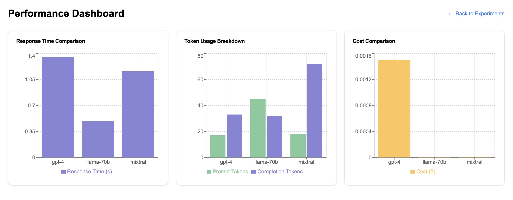
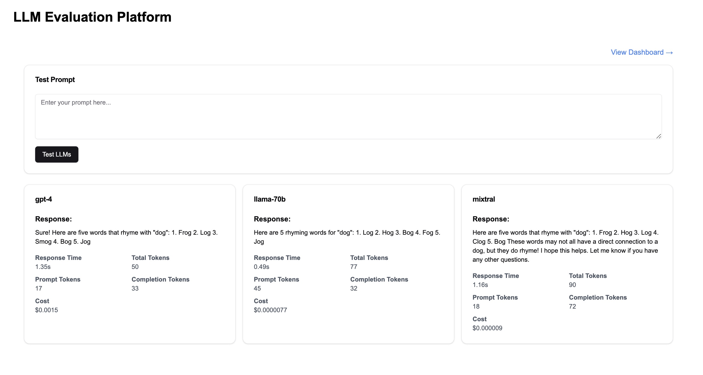

# LLM Evaluation Platform

A comprehensive platform for evaluating and comparing different Large Language Models (LLMs) in real-time. Test prompts across multiple models, analyze performance metrics, and make data-driven decisions about which LLM best suits your needs.

## 🌟 Features

- **Multi-Model Testing**: Test prompts across GPT-4, Llama 3.3 70B, Gemma 2 9B, and more
- **Real-time Comparison**: Side-by-side comparison of model responses
- **Advanced Analytics**: Visualize performance metrics with interactive charts
- **Cost Analysis**: Track and compare token usage and costs
- **Customizable Parameters**: Adjust temperature, max tokens, and system prompts
- **Performance Insights**: Get AI-powered recommendations based on your results
- **Modern UI**: Clean, responsive interface built with the latest web technologies

## Screenshots

### Dashboard Overview

*Real-time comparison of LLM performances and metrics visualization*

### Experiment Interface

*Interactive prompt testing and result analysis interface*

## 🛠️ Tech Stack

- **Frontend**: [Next.js 14](https://nextjs.org/) + [React 19](https://reactjs.org/) + [TypeScript](https://www.typescriptlang.org/)
- **UI**: [Shadcn/UI](https://ui.shadcn.com/) + [Tailwind CSS](https://tailwindcss.com/)
- **Data Viz**: [Recharts](https://recharts.org/)
- **State**: [Zustand](https://github.com/pmndrs/zustand)
- **Database**: [Prisma](https://www.prisma.io/) + [PostgreSQL](https://www.postgresql.org/)
- **APIs**: [OpenAI](https://openai.com/), [Groq](https://groq.com/)

## 🚀 Getting Started

### Prerequisites

- Node.js >= v18.0.0
- npm >= v8.0.0
- PostgreSQL

### 🔧 Installation

1. **Clone the repo**
```bash
git clone https://github.com/pc9350/LLM-Evaluation-platform
cd llm-evaluation-platform
```

2. **Install dependencies**
```bash
npm install
```

3. **Set up environment**
```bash
cp .env.example .env
```

4. **Configure your `.env`**
```bash
DATABASE_URL="postgresql://..."
OPENAI_API_KEY="..."
GROQ_API_KEY="..."
```

5. **Run migrations**
```bash
npx prisma migrate dev
```

6. **Start developing**
```bash
npm run dev
```

Visit `http://localhost:3000` - happy evaluating! 🎉

## 📊 Key Features Explained

### Advanced Model Comparison

Compare multiple LLMs side-by-side with detailed metrics:
- Response time
- Token usage (prompt and completion)
- Cost analysis
- Response quality

### Interactive Dashboard

Visualize your experiment results with:
- Bar charts for response time comparison
- Stacked charts for token usage breakdown
- Pie charts for cost distribution
- Radar charts for performance analysis
- Line charts for historical trends

### Customizable Experiments

Fine-tune your experiments with:
- Adjustable temperature settings
- Max token configuration
- System prompts
- Model selection

### Documentation & Resources

Access comprehensive documentation:
- Getting started guides
- Model specifications
- API reference
- Evaluation metrics explained

## 🤝 Contributing

We love contributions! Here's how you can help:

1. Fork it
2. Create your feature branch (`git checkout -b feature/AmazingFeature`)
3. Commit your changes (`git commit -m 'Add some AmazingFeature'`)
4. Push to the branch (`git push origin feature/AmazingFeature`)
5. Open a Pull Request

## 🙏 Acknowledgments

Built with amazing open-source tools:
- [Next.js](https://nextjs.org/)
- [Shadcn/UI](https://ui.shadcn.com/)
- [Recharts](https://recharts.org/)
- [Prisma](https://www.prisma.io/)
- [Zustand](https://github.com/pmndrs/zustand)

## 📫 Contact

Pranav Chhabra - [chhabrapranav2001@gmail.com](mailto:chhabrapranav2001@gmail.com)

Project Link: [https://github.com/pc9350/LLM-Evaluation-platform](https://github.com/pc9350/LLM-Evaluation-platform)

---

<p align="center">Made with ❤️ for the AI community</p>