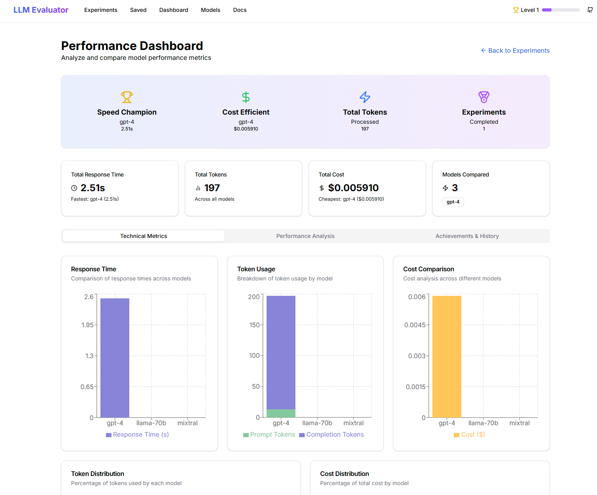
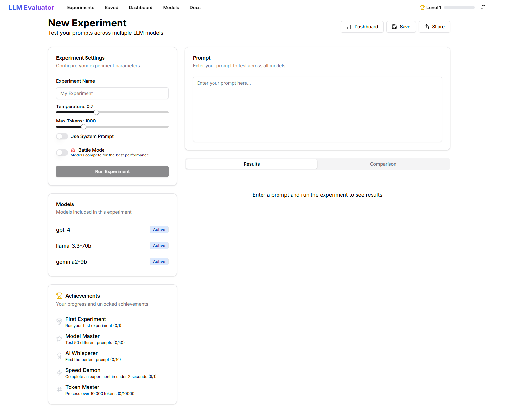

# LLM Evaluation Platform

A comprehensive platform for evaluating and comparing different Large Language Models (LLMs) in real-time. Test prompts across multiple models, analyze performance metrics, and make data-driven decisions about which LLM best suits your needs.

## Features

- **Multi-Model Testing**: Test prompts across GPT-4, Llama 3.3 70B, Gemma 2 9B, and more
- **Real-time Comparison**: Side-by-side comparison of model responses
- **Advanced Analytics**: Visualize performance metrics with interactive charts
- **Cost Analysis**: Track and compare token usage and costs
- **Customizable Parameters**: Adjust temperature, max tokens, and system prompts
- **Performance Insights**: Get AI-powered recommendations based on your results
- **Modern UI**: Clean, responsive interface built with the latest web technologies
- **Battle Mode**: Pit models against each other to determine the best performer for specific tasks
- **Experiment Management**: Save, load, and share your experiment results for future reference
- **Gamification System**: Earn XP, level up, and unlock achievements as you use the platform

## Screenshots

### Dashboard Overview

*Real-time comparison of LLM performances and metrics visualization*

### Experiment Interface

*Interactive prompt testing and result analysis interface*

## Getting Started

### Prerequisites

- Node.js >= v18.0.0
- npm >= v8.0.0
- PostgreSQL

### Installation

1. **Clone the repo**
```bash
git clone https://github.com/pc9350/LLM-Evaluation-platform
cd llm-evaluation-platform
```

2. **Install dependencies**
```bash
npm install
```

3. **Set up environment**
```bash
cp .env.example .env
```

4. **Configure your `.env`**
```bash
DATABASE_URL="postgresql://..."
OPENAI_API_KEY="..."
GROQ_API_KEY="..."
```

5. **Run migrations**
```bash
npx prisma migrate dev
```

6. **Start developing**
```bash
npm run dev
```

Visit `http://localhost:3000` - happy evaluating! 🎉

## Key Features Explained

### Advanced Model Comparison

Compare multiple LLMs side-by-side with detailed metrics:
- Response time
- Token usage (prompt and completion)
- Cost analysis
- Response quality

### Interactive Dashboard

Visualize your experiment results with:
- Bar charts for response time comparison
- Stacked charts for token usage breakdown
- Pie charts for cost distribution
- Radar charts for performance analysis
- Line charts for historical trends

### Battle Mode

Directly compare model performance with a competitive edge:
- Automatic winner determination based on response time
- Visual highlighting of the winning model
- Performance points system for objective comparisons
- Perfect for quickly identifying the best model for specific tasks

### Gamification System

Make LLM evaluation more engaging:
- Earn XP for running experiments and unlocking achievements
- Level up to unlock advanced platform features
- Track achievements like "First Experiment," "Model Master," and "Token Master"
- Visualize your progress on the user dashboard

### Customizable Experiments

Fine-tune your experiments with:
- Adjustable temperature settings
- Max token configuration
- System prompts
- Model selection

### Documentation & Resources

Access comprehensive documentation:
- Getting started guides
- Model specifications
- API reference
- Evaluation metrics explained

## Contributing

We love contributions! Here's how you can help:

1. Fork it
2. Create your feature branch (`git checkout -b feature/AmazingFeature`)
3. Commit your changes (`git commit -m 'Add some AmazingFeature'`)
4. Push to the branch (`git push origin feature/AmazingFeature`)
5. Open a Pull Request

## Contact

Pranav Chhabra - [chhabrapranav2001@gmail.com](mailto:chhabrapranav2001@gmail.com)

Project Link: [https://github.com/pc9350/LLM-Evaluation-platform](https://github.com/pc9350/LLM-Evaluation-platform)

---

<p align="center">Made with ❤️ for the AI community</p>